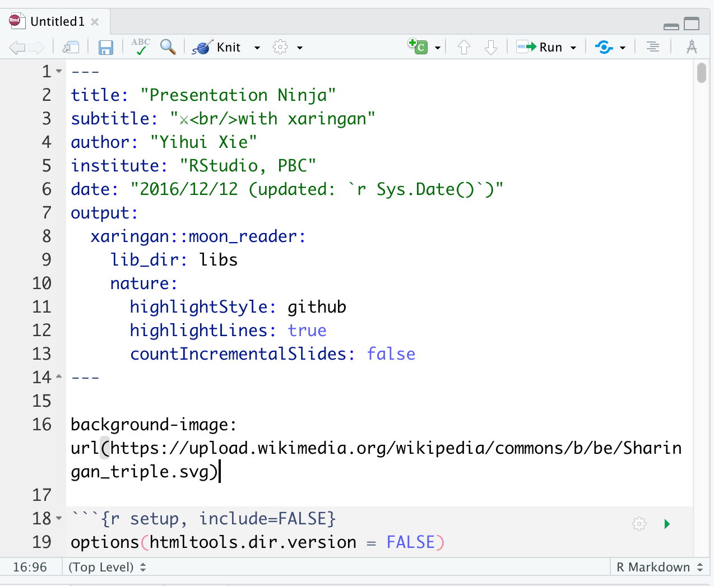
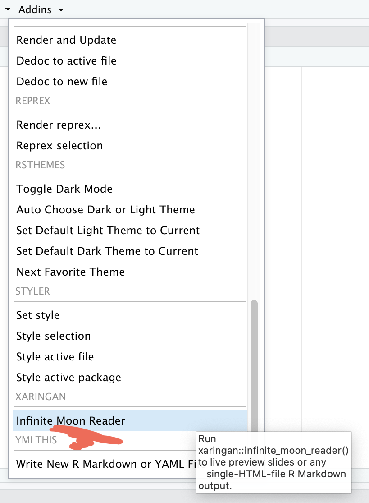

class: hide-count, center, middle

```{r setup, echo=FALSE, message=FALSE}
options(htmltools.dir.version = FALSE)
knitr::opts_chunk$set(
  collapse = TRUE,
  fig.retina = 3,
  comment = "",
  echo = F
)
library(ymlthis)
library(emo)
library(emojifont)
library(tidyverse)
library(fontawesome)
library(magick)
library(icon)
library(xaringanExtra)
xaringanExtra::use_tachyons()
xaringanExtra::use_tile_view()
xaringanExtra::use_webcam()
xaringanExtra::use_fit_screen()
xaringanExtra::use_extra_styles(hover_code_line = TRUE, mute_unhighlighted_code = TRUE)
#xaringanExtra::use_share_again()
xaringanExtra::use_panelset()
#<a class="footer-link" href="https://r4b.netlify.app/">r4b/share</a>
options(htmltools.dir.version = FALSE, htmltools.preserve.raw = FALSE)

library(xaringanthemer)
library(DiagrammeR)
library(kableExtra)
```

background-image: url("https://media.giphy.com/media/LVCdHNPTIY2be/giphy.gif")
background-size: cover

# .b.white[`r rmarkdown::metadata$title`]

# .center.b.ttu.f3.white.pv1[By: `r rmarkdown::metadata$author`]

### .b.white[Lightning talk at R-Ladies Pune]


### .b.white[`r format(Sys.Date(), "%d %B %Y")`]

---

background-image: url("images/xie.jpg"), url("https://user-images.githubusercontent.com/163582/45438104-ea200600-b67b-11e8-80fa-d9f2a99a03b0.png")
background-size: 25%, 15%
background-position: 99% 1%, 95% 90%

# Xaringan (sha-ringan) package

- created by: [Xie Yihui](https://yihui.org/en/)

--

- [why](https://yihui.org/en/2017/08/why-xaringan-remark-js/): "never truly happy with any of the Markdown-based slide generation tools"

--

- [what](https://bookdown.org/yihui/rmarkdown/xaringan.html)  "is an R Markdown extension based on the JavaScript library remark.js <br>to generate HTML5 presentations of a different style"

---
class: center

# File $\longrightarrow$ New File $\longrightarrow$ R Markdown

```{r out.width="75%"}
knitr::include_graphics("images/rmd-new.png")
```

---
class: center

# Template $\rightarrow$ Ninja Presentation

```{r out.width="50%"}
knitr::include_graphics("images/xar1.png")
```

---
class: center

# Save this `.Rmd` file

```{r out.width="50%"}

```

---
class: center

.pull-left[
### Addins $\rightarrow$ Inifinite Moon Reader

```{r out.width="65%"}

```
]

--

.pull-right[

### xaringan output 

```{r }
knitr::include_graphics("images/xar4.png")
```
]

---
class: center

.pull-left[
### Addins $\rightarrow$ Inifinite Moon Reader

```{r out.width="65%"}

```
]

.pull-right[

### xaringan slide $\rightarrow$ browser 

```{r }
knitr::include_graphics("images/xar5-browser.png")
```
]

--

- We need to click `Inifinite Moon Reader` only once to start the slideshow. To see the changes made in the slides just save the document `ctrl + s`

---
class: center

.pull-left[

# Copy-paste culture ...

```{r}
grViz("
digraph boxes_and_circles {

  # a 'graph' statement
  graph [overlap = true, fontsize = 10]

  # several 'node' statements
  node [shape = box,
        fontname = Helvetica]
  software1; software2; software3; software4; software5; software6; software7;  doc; pdf; slides

  node [shape = circle,
        fixedsize = true,
        width = 0.9] // sets as circles
  images; tables; stats; plots; refs

  # several 'edge' statements
  software1 -> images software2 -> tables software3 -> stats  software4 -> plots software5 -> refs software6 -> doc  software6 -> pdf software7 -> slides
  images -> doc tables -> doc stats -> doc plots -> doc refs -> doc
  doc -> pdf
  pdf -> slides
}
")
```

]

--

.pull-right[

# crumbles easily

```{r}
knitr::include_graphics("https://media.giphy.com/media/mEEKBRIQy6iucFVCi9/giphy.gif")
```

]

---

# Plots

```{r fig.height=7, fig.width=20}
penguins1 <- read.csv("data/penguins.csv")

penguins1 %>% 
  drop_na() %>% 
  count(sex) %>% 
ggplot(aes(y = sex,
           x = n,
           fill = sex)) +
  geom_col() +
  geom_text(aes(label = n), size = 15, color = "white", hjust = 2) +
  theme(text = element_text(size = 50),
        legend.position = "none") +
  labs(
    x = "Number of penguins",
    y = "Sex"
  )

```

---

.pull-left[
# Table

```{r}
library(sjPlot)
library(sjmisc)
library(sjlabelled)
mod1 <- lm(bill_depth_mm ~ flipper_length_mm + body_mass_g + bill_length_mm,
           data = penguins1) 

tab_model(mod1)
```
]

--

.pull-right[
# Text In-line output

###- The total sample size was $n$ = `r nrow(penguins1)`

]

---

class: center, middle

background-image: url("images/pune.jpg")
background-size: cover

# .white[Beautiful Pune !]

---

background-image: url("https://raw.githubusercontent.com/gadenbuie/xaringanthemer/master/man/figures/logo.png")
background-size: 15%
background-position: 90% 1%

# xaringan + [xaringanthemer](https://github.com/gadenbuie/xaringanthemer):

<br>
<br>
```{r}
knitr::include_graphics("https://raw.githubusercontent.com/gadenbuie/xaringanthemer/assets/examples.gif")
```

---

# xaringan + [xaringanExtra](https://github.com/gadenbuie/xaringanExtra)

```{r out.width="60%", fig.align='center'}
knitr::include_graphics("https://raw.githubusercontent.com/gadenbuie/xaringanExtra/master/man/figures/panelset.gif")
```

---

background-image: url("https://raw.githubusercontent.com/jhelvy/xaringanBuilder/master/man/figures/hex_sticker.png")
background-size: 15%
background-position: 90% 1%

# xaringan + [xaringanBuilder](https://github.com/jhelvy/xaringanBuilder)

- html

- pdf

- gif

- pptx

- mp4

- png

- social (png of first slide sized for sharing on social media)


---

class: center

.pull-left[

# Be in touch!

```{r instructor-img, echo=FALSE, out.width="50%"}
magick::image_read("images/ajay.png") 
```

.f2[`r icon::fa("laptop")` [Assist. Professor <br>Vishwakarm University, <br>Pune - India](https://www.vupune.ac.in/) <br>
`r icon::fa("link")` [https://r4b.netlify.app/](https://r4b.netlify.app/) <br>
`r icon::fa("twitter")`[@ajay_kolii](https://twitter.com/ajay_kolii)] 
]

--

.pull-right[

# Thank you

```{r rld-p, out.width="60%"}
knitr::include_graphics("https://pbs.twimg.com/profile_images/1195170972724105219/pICxWNlC_400x400.jpg")
```

# R-Ladies Pune
]
